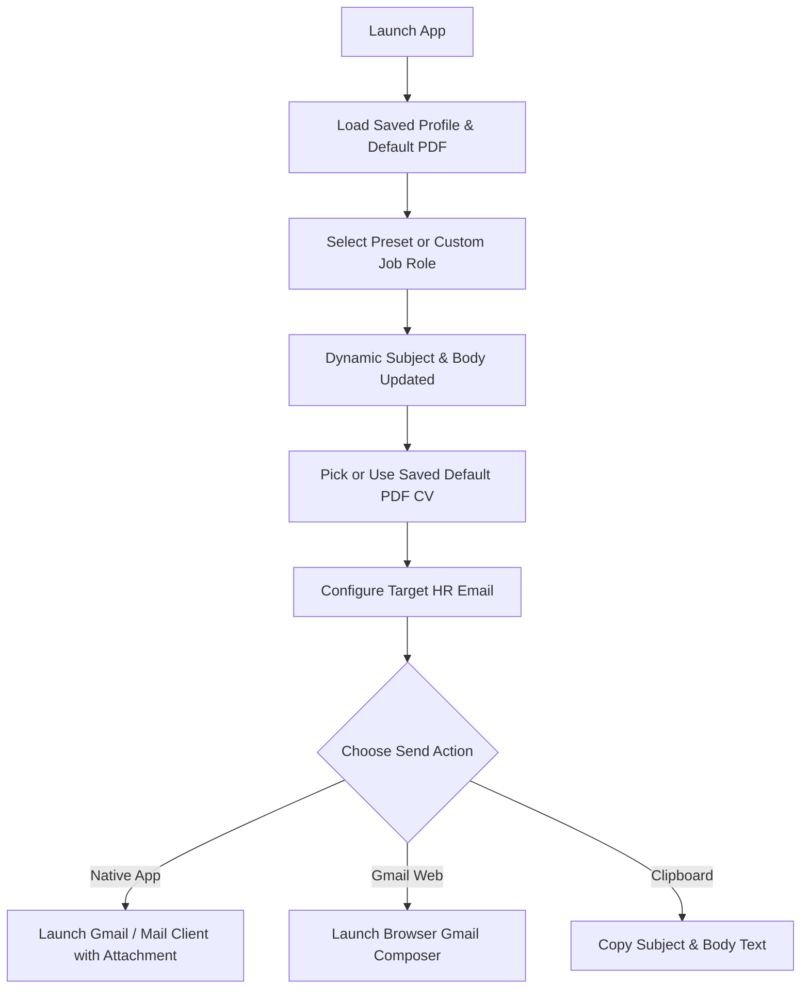

# ✉️ Job Application Mailer

[](https://flutter.dev)
[](https://dart.dev)
[](https://github.com/LakviruPerera/job-application-mailer/actions)
[](LICENSE)

**Job Application Mailer** is a sleek, cross-platform Flutter application built to streamline and automate sending tailored job application emails with attached PDF resumes, custom templates, and local data persistence.

---

## ✨ Features

- 🎯 **Preset & Custom Role Selector**: Choose from predefined job roles (`Intern Software Engineer`, `Intern Frontend Developer`, `Intern Full Stack Developer`) or enter a user-specific custom role.
- ⚡ **Dynamic Template Engine**: Automatically updates both the email subject (`Application for [Role]`) and email body text in real time.
- 📎 **PDF CV Attachment Manager**: Pick PDF resumes, view file details, and check **"Save as default CV"** to auto-attach your resume in future sessions.
- 👤 **Local Profile & Sender Settings**: Persist default sender email, applicant name, phone number, education, and technical stack locally using `SharedPreferences`.
- ✉️ **Native Mail & Gmail Web Integration**: Launch native device mail apps pre-filled with recipient, subject, body, and attached PDF, or open Gmail Web directly.
- 📋 **Quick Clipboard Actions**: One-tap copy for email subject and body text with instant toast notifications.
- 🎨 **Modern Glassmorphic UI/UX**: Built with **Google Fonts (`Plus Jakarta Sans`)**, vibrant indigo/emerald accents, micro-animations, and full **Light & Dark Mode** support.
- 🚀 **Automated GitHub Actions CI/CD**: Automatic compilation of Android release APKs and GitHub Release publishing.

---

## 🛠️ Technology Stack

| Component | Technology / Package |
| :--- | :--- |
| **Framework** | [Flutter](https://flutter.dev) (Dart 3.x) |
| **Local Persistence** | [`shared_preferences`](https://pub.dev/packages/shared_preferences) |
| **File Picker** | [`file_picker`](https://pub.dev/packages/file_picker) |
| **Email Launchers** | [`flutter_email_sender`](https://pub.dev/packages/flutter_email_sender) & [`url_launcher`](https://pub.dev/packages/url_launcher) |
| **Typography** | [`google_fonts`](https://pub.dev/packages/google_fonts) |
| **Animations** | [`flutter_animate`](https://pub.dev/packages/flutter_animate) |
| **CI/CD Pipeline** | GitHub Actions (`.github/workflows/build_apk_release.yml`) |

---

## 🚀 Getting Started

### Prerequisites
- [Flutter SDK](https://docs.flutter.dev/get-started/install) (v3.19.0 or higher)
- [Dart SDK](https://dart.dev/get-started) (v3.0.0 or higher)
- Android Studio / VS Code with Flutter extension

### Installation

1. **Clone the repository**:
   ```bash
   git clone https://github.com/LakviruPerera/job-application-mailer.git
   cd job-application-mailer
   ```

2. **Install dependencies**:
   ```bash
   flutter pub get
   ```

3. **Run the application**:
   ```bash
   flutter run
   ```

---

## 📱 Application Flow



---

## 🤖 Continuous Integration & Releases (GitHub Actions)

This repository includes a pre-configured GitHub Actions workflow located at [.github/workflows/build_apk_release.yml](.github/workflows/build_apk_release.yml).

- **On Push to `main`**: Automatically compiles the Android release APK (`app-release.apk`) and uploads it to GitHub Actions artifacts.
- **On Version Tag Push (`v*`)**: Automatically creates an official GitHub Release with `app-release.apk` attached for direct download.

To trigger an automated release build:
```bash
git tag v1.0.0
git push origin v1.0.0
```

---

## 📄 License

This project is licensed under the MIT License - see the [LICENSE](LICENSE) file for details.

---

## 👨‍💻 Author

**Lakviru Perera**  
- Contact: `0704224786`  
- Software Engineering Undergraduate
